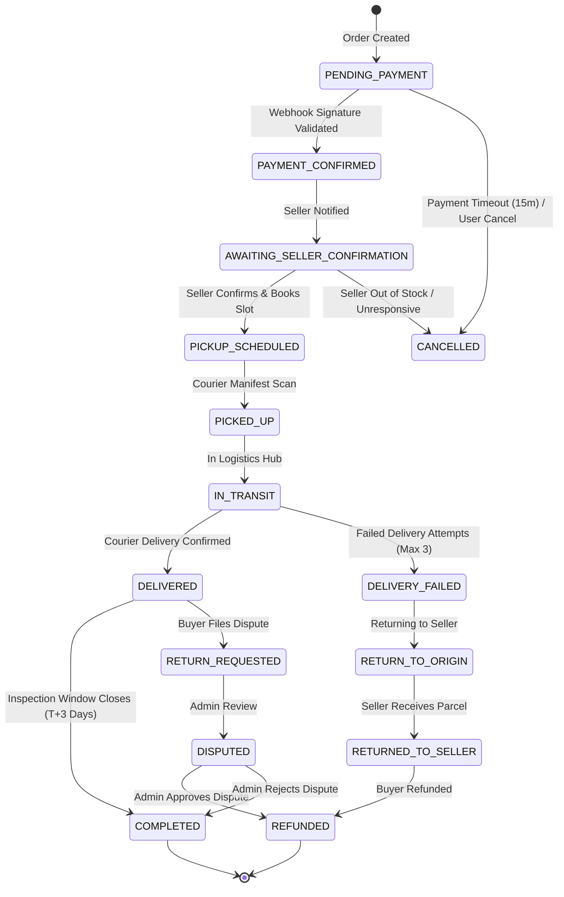
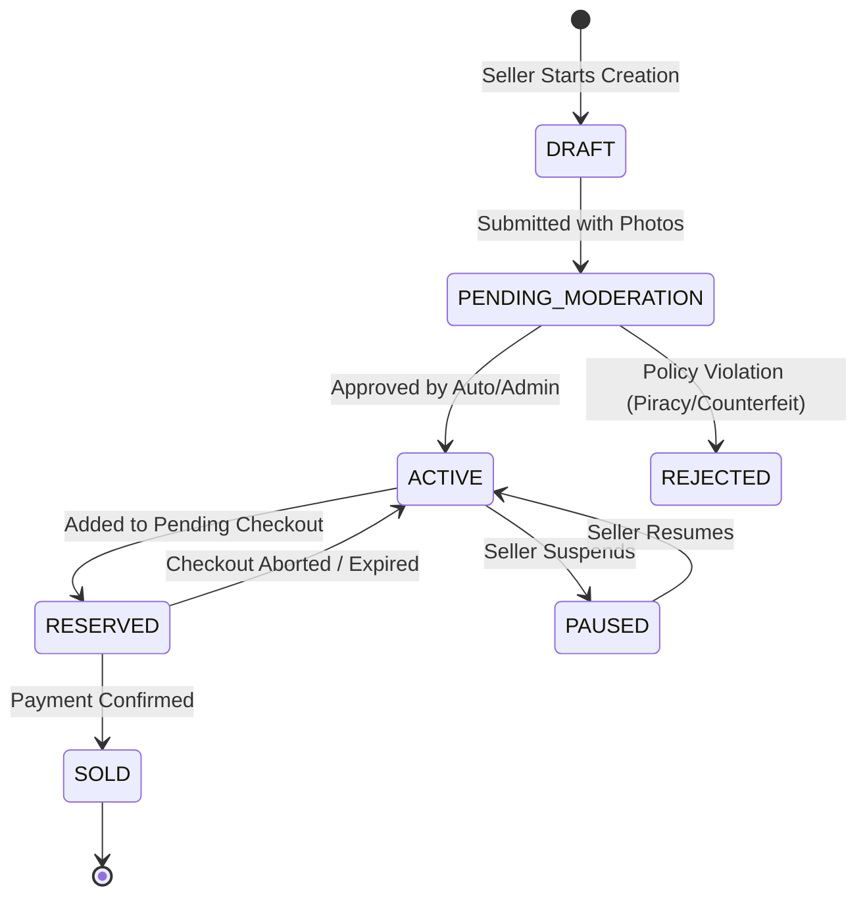

# BookLoop Lifecycle State Machines

```mermaid
stateDiagram-v2
    [*] --> PENDING_PAYMENT : Order Created
    PENDING_PAYMENT --> PAYMENT_CONFIRMED : Webhook Signature Validated
    PENDING_PAYMENT --> CANCELLED : Payment Timeout (15m) / User Cancel
    
    PAYMENT_CONFIRMED --> AWAITING_SELLER_CONFIRMATION : Seller Notified
    AWAITING_SELLER_CONFIRMATION --> PICKUP_SCHEDULED : Seller Confirms & Books Slot
    AWAITING_SELLER_CONFIRMATION --> CANCELLED : Seller Out of Stock / Unresponsive
    
    PICKUP_SCHEDULED --> PICKED_UP : Courier Manifest Scan
    PICKED_UP --> IN_TRANSIT : In Logistics Hub
    IN_TRANSIT --> DELIVERED : Courier Delivery Confirmed
    IN_TRANSIT --> DELIVERY_FAILED : Failed Delivery Attempts (Max 3)
    
    DELIVERY_FAILED --> RETURN_TO_ORIGIN : Returning to Seller
    RETURN_TO_ORIGIN --> RETURNED_TO_SELLER : Seller Receives Parcel
    RETURNED_TO_SELLER --> REFUNDED : Buyer Refunded
    
    DELIVERED --> COMPLETED : Inspection Window Closes (T+3 Days)
    DELIVERED --> RETURN_REQUESTED : Buyer Files Dispute
    
    RETURN_REQUESTED --> DISPUTED : Admin Review
    DISPUTED --> REFUNDED : Admin Approves Dispute
    DISPUTED --> COMPLETED : Admin Rejects Dispute
    
    COMPLETED --> [*]
    REFUNDED --> [*]
```

## Listing State Transitions

```mermaid
stateDiagram-v2
    [*] --> DRAFT : Seller Starts Creation
    DRAFT --> PENDING_MODERATION : Submitted with Photos
    PENDING_MODERATION --> ACTIVE : Approved by Auto/Admin
    PENDING_MODERATION --> REJECTED : Policy Violation (Piracy/Counterfeit)
    
    ACTIVE --> RESERVED : Added to Pending Checkout
    RESERVED --> ACTIVE : Checkout Aborted / Expired
    RESERVED --> SOLD : Payment Confirmed
    
    ACTIVE --> PAUSED : Seller Suspends
    PAUSED --> ACTIVE : Seller Resumes
    
    SOLD --> [*]
```
